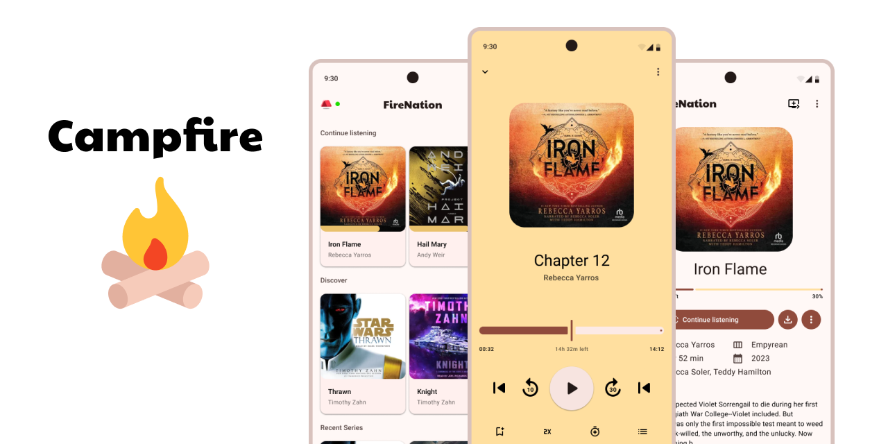

# Campfire

**Campfire** is an unofficial app for [Audiobookshelf](https://www.audiobookshelf.org/) built in Kotlin/Compose Multiplatform for a more native experience than the official app.

## This is a **WIP** project and no timeline will be given at this point in time

* [Kotlin Multiplatform][kotlin-multiplatform]
* [Jetbrains Compose Multiplatform][compose-multiplatform]
* Presentation Architecture: [Slack's Circuit][slack-circuit]
* Networking: [Ktor Client][ktor]
* Storage
  * [SQLDelight][sql-delight]
  * [Store5][store]
* Dependency Injection
  * [kotlin-inject][kinject]
  * [kimchi](kimchi)

[kotlin-multiplatform]: https://kotlinlang.org/docs/multiplatform.html
[compose-multiplatform]: https://www.jetbrains.com/lp/compose-multiplatform/
[slack-circuit]: https://slackhq.github.io/circuit/
[ktor]: https://ktor.io/docs/welcome.html
[sql-delight]: https://cashapp.github.io/sqldelight/2.0.0/multiplatform_sqlite/
[store]: https://github.com/MobileNativeFoundation/Store
[kinject]: https://github.com/evant/kotlin-inject
[kimchi]: https://github.com/r0adkll/kimchi

## Contributing

Please follow the guidelines set forth in the [CONTRIBUTING](CONTRIBUTING.md) document.

## License

GNU General Public License v3.0

See [LICENSE](LICENSE) to see the full text.
