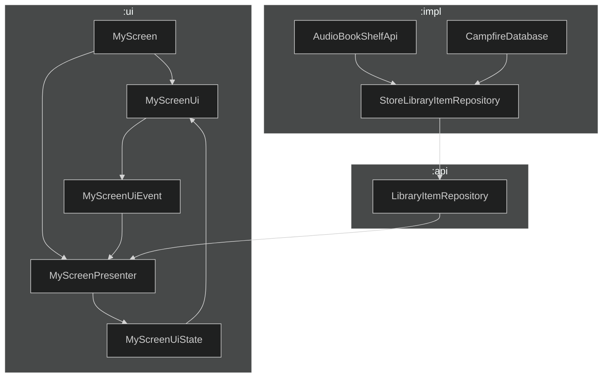

# Architecture

This document provides an overview of the architecture decisions used in this project. _TODO: Should describe more here really_

## Table of contents

1. [Modularization](MODULARIZATION.md)
2. [UI Layer](UI_LAYER.md)
3. [Data Layer](DATA_LAYER.md)

### UI Layer

